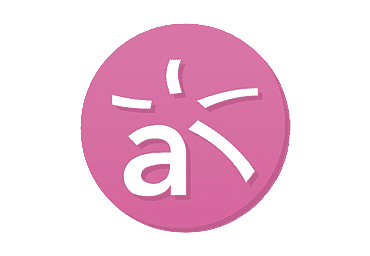

# serraTec2021
<a name="back-to-top">

  

  
<h1 align="center">👨🏼‍💻Repositório pessoal da residência de Software, feita por mim em 2021.feat The Zeressemos Team</h1>
<h2 align="center">https://github.com/OsZeressemos</h2>

   

 ##  Tecnologia Utilizada

 [**HTML5**]
 [**CSS**]
 [**JavaScript**]
 [**Java**]
 [**React**]
 [**React Native**]
 [**PostgreSQL**]
 [**DBeaver**]
 [**Visual Studio Code**]
 [**Eclipse**]
 [**Spring Boot**]
 [**Spring Tools 4**]  
 [**Postman**]
 [**Oracle JDK**]
[**UML Designer**]
[**Draw.io**]
 [**Portugol Studio**]
 [**Astah**]
 [**IntelliJIdeaUltimate**]

 
